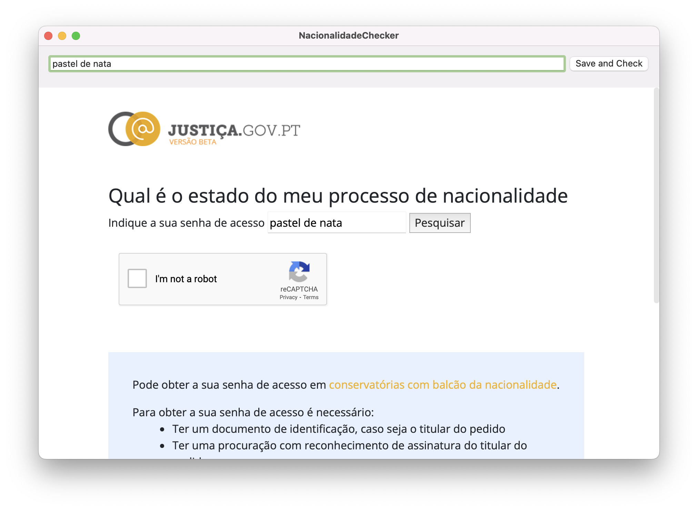

# NacionalidadeChecker
WebView com autofill da senha do processo de nacionalidade portuguesa

# Screenshot

  

# Download
Link da última versão [here](https://github.com/Bunn/nacionalidadechecker/releases/latest)

# Disclaimer
Eu estava cansado de ter que digitar minha senha repetidamente, e nenhum gerenciador de senhas estava funcionando corretamente para o preenchimento automático. Por isso, criei esse simples aplicativo que injeta a senha e ativa o preenchimento automático de forma forçada. Inicialmente, desenvolvi essa solução para meu uso pessoal, mas estou disponibilizando publicamente, caso ela seja útil para outras pessoas.
ps. O captcha é por sua conta :) 